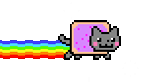

Hi there!
My name is Ivan Bogdanov
=====================================================================================================================================

I'm a frontend developer
------------------------

* 🧠  I'm learning React, Docker

### Skills

### Socials

  

### Connect with me

<a target="_blank" href="mailto:ivan.bogdv@gmail.com"></img></a>
<a target="_blank" href="https://t.me/ivanbogdv"></img></a>

